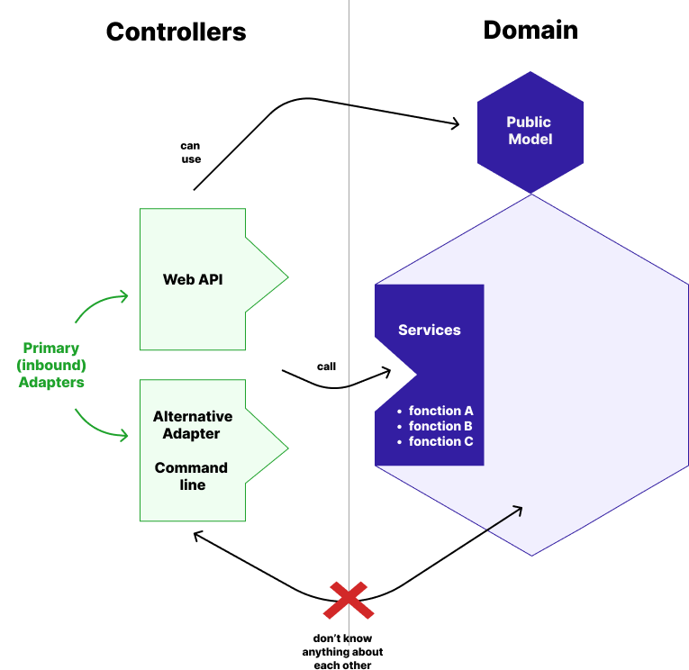
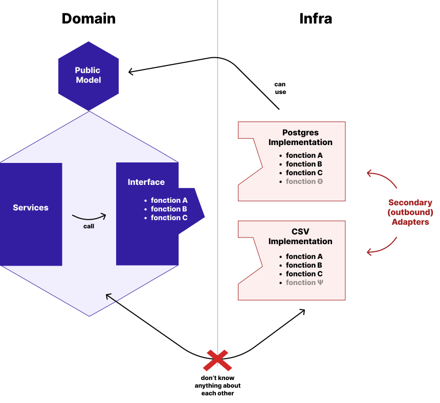
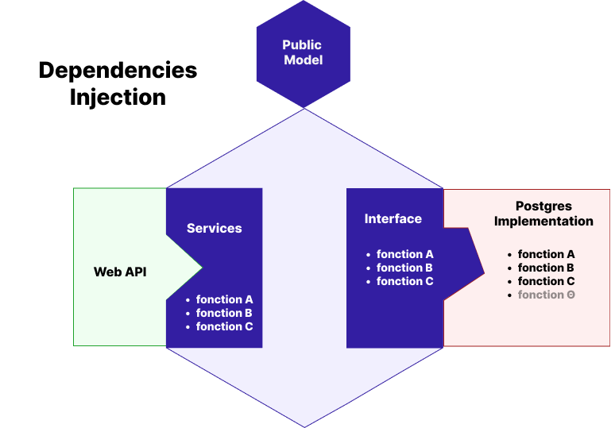

## BackEnd

Le backend est structuré selon les principes d'[architecture hexagonale](https://alistair.cockburn.us/hexagonal-architecture/), principe développé par [Alistair Cockburn](https://en.wikipedia.org/wiki/Alistair_Cockburn). 

Sa priorité est de proposer une organisation du code assurant la répartition des responsabilités de façon à pouvoir facilement modifier le comportement ou l'implémentation d'une section sans impacter le reste de la base de code. 

Le code est divisé en trois parties distinctes :
 - **Domain** : le coeur de l'application contenant toute l'intelligence métier
 - **Controller** : les points d'entrée permettant à des services tiers ou des utilisateurs de faire appel au *Domain* 

 - **Infra** : les services auxquels fait appel le *Domain*

### How they interacts

#### Domain
The Domain offers its services in **domain.services** and its data model in **domain.model.public**.

{: .note }
> The domain cannot import any **controller.\*\*\*** module
>
> It can only import **abc_\*\*\*** class from the infra

#### Controllers
As of today, there is only one controller which is the web API defined by **controller.api.yaml**. It can be called by any external services or user without authentication. Neither the Domain or the Infra has any visibility on the controllers behavior. 

{: .note }
> The controller can only use **domain.services** or **domain.model.public**. There can't be any other **domain.\*\*\*** import 
>
> The controller can't use any **infra.\*\*\*** services or object for itself
>
> The only place  **infra.\*\*\*** import can be found is the **controller.dependencies_injection** module. Any other import is prohibited.  

#### Infra

The Infra defines the available services in abstract classes that are named following the format **abc_\*\*\***. For each of these, it can offers one or more implementation that can be selected during the dependencies injection (**controller.dependencies_injection**)

{: .note }
> The infra can't import any **controller.\*\*\*** module
>
> The only thing it can import from the rest of the code base is the **domain.model.public** 

#### Dependencies Injection

The "puzzle pieces" are selected buring the dependencies injection. They can be easily replaced depending of the configuration needed (dev, prod, test).

## FrontEnd

